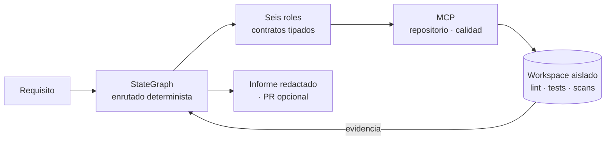

# ASET — Autonomous Engineering Team


Un equipo de ingeniería de software gobernado, que corre en tu máquina y trabaja
sobre un repositorio real. Recibe un requisito y lo lleva por seis etapas
—producto, arquitectura, implementación, seguridad, pruebas y revisión—
produciendo en cada una un contrato tipado y evidencia ejecutada, no prosa.

Lo que distingue a ASET no es que varios modelos conversen, sino que **ningún
modelo decide el paso siguiente**. Un grafo de estados determinista enruta el
trabajo según la evidencia declarada, y las compuertas rechazan lo que ninguna
prueba demuestra.

## Cómo funciona



- **Las herramientas viven detrás de MCP.** Un servidor de repositorio y otro de
  calidad hablan por stdio; los comandos del proyecto corren siempre dentro de un
  contenedor Docker, nunca sobre el intérprete del operador.
- **Cada componente trae su propio toolchain.** Los perfiles `python`, `jvm`,
  `dotnet`, `go` y `node` declaran instalación, lint, pruebas, build, integridad
  de dependencias, evidencia de seguridad y migración de esquema.
- **La revisión humana es una salida real.** Cualquier etapa puede terminar en
  `HUMAN_REVIEW_REQUIRED`. La remediación está acotada: el rechazo número
  `MAX_REMEDIATION_ITERATIONS` (5 por omisión), o la tercera aparición en la
  corrida de la misma clase de fallo, detiene la automatización en lugar de
  reintentar indefinidamente.
- **Se redacta antes de negar.** Los secretos se enmascaran en el prompt antes de
  que una guardarraíl rechace la operación.

El detalle está en la [arquitectura](docs/architecture/overview.md) y el porqué,
en las [decisiones](docs/architecture/decisions/README.md).

## Requisitos

- Python ≥ 3.10
- Un runtime de modelos: [Ollama](https://ollama.com) en local, o claves de
  proveedor en la nube
- Docker: el contenedor es la única frontera de ejecución, así que sin él no hay gate de calidad
- Node, solo para el frontend

## Instalación

```sh
python3 -m venv .venv && source .venv/bin/activate
pip install -e ".[dev]"
cp .env.example .env
```

Extras declarados en `pyproject.toml`:

| Extra | Instala | Para |
|---|---|---|
| `dev` | pytest, pytest-cov, ruff | Desarrollo y pruebas |
| `rag` | chromadb, langchain-core, langchain-text-splitters, sentence-transformers | Recuperación sobre el corpus |
| `observability` | langfuse | Trazas de ejecución |
| `sample-app` | fastapi, uvicorn | Run API y proyecto de demo |
| `quality-toolchain` | pytest, ruff y dependencias fijadas | Toolchain Python bloqueado de la compuerta de calidad |

## Uso

```sh
python3 -m engineering_team.cli --help
python3 -m engineering_team.cli run-project --help
```

| Comando | Qué hace |
|---|---|
| `run` | Ejecuta el flujo y escribe un informe de evidencia redactado |
| `run-project PATH --spec "..."` | Ejecuta sobre un repositorio real; admite `--test-spec`, `--repo URL` (clon temporal que no sobrevive al run, excluyente con `PATH`), `--clone-depth` y `--report-path` |
| `reset-project PATH` | Restaura el repositorio de demo. **Destructivo** |
| `docker-sweep` | Retira los recursos Docker etiquetados por ASET que ningún run vivo posee; `--build-cache` poda además la caché del daemon |

`run-project` es de solo lectura por omisión: escribir en el proyecto exige
`--authorize-writes`, y abrir un pull request exige además `--confirm-delivery`
y el backend `gh`. Las ramas se crean bajo el espacio `aset/`. Que no haya
autorización de escritura no significa que no haya coste ni informes.

Tras la instalación editable, `pyproject.toml` también expone el ejecutable
`engineering-team`.

## Configuración

Todo se configura por variables de entorno leídas en
[`config.py`](src/engineering_team/config.py): cada campo de `Settings` en
mayúsculas. `.env.example` recoge las de uso habitual; la lista completa está en
`Settings`. Las de uso más frecuente:

| Variable | En `.env.example` | Efecto |
|---|---|---|
| `LOCAL_FIRST` | `false` | Intenta primero el modelo local |
| `CLOUD_ENABLED` | `true` | Habilita las cadenas de proveedor en la nube |
| `OLLAMA_BASE_URL` | `http://localhost:11434` | Runtime local |
| `QUALITY_TIMEOUT_SECONDS` | `600` | Presupuesto por operación de QualityMCP |
| `QUALITY_TEST_FILTER` | vacío | Qué pruebas corre la compuerta |
| `WORKSPACE_ROOT` | `workspace/runs` | Raíz de los espacios aislados |

Sin `.env`, los valores de clase son `LOCAL_FIRST=true` y `CLOUD_ENABLED=false`.
Detalle completo en [operaciones](docs/operations.md).

## Pruebas

```sh
PYTHONPATH=src python3 -m pytest
```

La suite se organiza por alcance: `tests/unit/`, `tests/mcp/`, `tests/graph/`,
`tests/integration/`, `tests/rag/` y `tests/e2e/`, más `tests/test_run_api.py`.
El alcance de cada grupo, qué exige ejecutar cada uno y cómo aislarla del
entorno del shell están en [pruebas](docs/testing.md).

```sh
python3 -m ruff check src tests
```

## Estado

Este README describe capacidades implementadas y verificadas en el código. **La
existencia de una integración no implica validación en vivo**: la evidencia
ejecutada tiene un único propietario, [estado](docs/status.md), que también
registra lo que se retiró y no debe recrearse.

## Documentación

| | |
|---|---|
| [Mapa del proyecto](AGENTS.md) | Punto de entrada para agentes y personas |
| [Mapa por tarea](docs/README.md) | Dónde cambiar cada parte y qué comprobar |
| [Arquitectura](docs/architecture/overview.md) | Composición implementada |
| [Decisiones](docs/architecture/decisions/README.md) | Por qué el sistema es así |
| [Operaciones](docs/operations.md) | Instalación, configuración, CLI y frontend |
| [Pruebas](docs/testing.md) | Comandos y alcance de validación |
| [Estado](docs/status.md) | Evidencia y limitaciones actuales |
| [Historia](docs/history.md) | Decisiones documentales y retiros |
