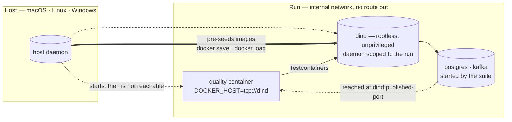

# 14. The run gets a Docker API that is not the host's

Date: 2026-09-09. Status: accepted.
Lifts the constraint in: [ADR 10](0010-integration-tests-need-the-host-docker-api.md)
Reuses the boundary from: [ADR 5](0005-services-per-run.md)

## Context

ADR 2 decided that target-project commands execute in a container, and expected
the process sandbox to become a fallback. ADR 10 measured that it cannot: a
suite that drives containers itself — Testcontainers and equivalents — has no
route to a Docker API from inside the quality container. Trials 6b and 9 failed
to pull `postgres:17-alpine` with `ContainerFetchException` while every other
gate passed; trial 10 ran the same `OrderFlowIntegrationTest` six of six in
11.6 seconds under the process sandbox. ADR 10 therefore made the process
sandbox the supported path for that class of component, and refused the obvious
shortcut: mounting the host's Docker socket hands the quality container the
power to start any container on the host, which is the boundary ADR 2 exists to
draw.

That resolution is correct and it has a cost that has not been stated anywhere
until now. The process sandbox is per-platform by construction:

| Host | `process` | `container` |
|---|---|---|
| macOS | `sandbox-exec` | Docker Desktop |
| Linux | Bubblewrap | Docker |
| Windows | refused (`mcp/runner.py:447`) | Docker Desktop |

Crossed with ADR 10, the table says something the project has not decided out
loud: **a target project whose tests drive containers cannot be processed on
Windows at all.** Not slower, not degraded — there is no supported path. The
system is meant to run on all three hosts, so this is a capability tied to a
platform rather than a limit of a backend.

Two further facts narrow the choice.

`sandbox-exec` is deprecated. Apple's own manual page reads `sandbox-exec –
execute within a sandbox (DEPRECATED)`. The macOS half of the process backend
rests on an interface developers have been told to stop using, so `process` is
not a stable floor on two of the three hosts.

`ProcessRunner` is already written for Windows everywhere except the boundary.
`_VENV_BIN` selects `Scripts` under `nt` (line 29); `COMSPEC`, `PATHEXT`,
`SYSTEMDRIVE`, `SYSTEMROOT` and `WINDIR` are in the passthrough set (lines
37-38); process-group handling branches on `os.name == "nt"` in five places; and
`_terminate_windows_tree` exists in full. The missing piece is not supervision.
It is one isolation primitive.

The question is therefore not how to write a third sandbox. ADR 10 already named
the exit: *"until a container backend can offer a container API that is not the
host's — a nested runtime, or a daemon scoped to the run."*

## Decision

Give the run its own Docker daemon, as a sibling container on the run's internal
network, and point the quality container at it through `DOCKER_HOST`.

This is not a new mechanism for this system. It is the topology ADR 5 already
designed, argued and verified for a project's services, with a daemon in the
place of a database: siblings resolve each other by name, the network reaches
nothing else, and the run's lifetime bounds everything started inside it.

What the suite reaches is a daemon whose entire population belongs to this run.
Killing the run kills the daemon, and the daemon takes its containers with it.
The host's daemon is what started the two, and is not addressable from either.

Two mechanics of that picture are not free, and both were measured before this
record was accepted.

**Images arrive before the network closes, not over it.** An internal network has
no route to a registry, so the run-scoped daemon cannot pull. The images a
component's suite needs are loaded into it from the host's cache — `docker save`
piped to `docker load` — while it starts. This keeps ADR 5's boundary exactly as
written instead of trading it for a second, routable network, and it makes the
set of images a run may start an explicit input rather than whatever the suite
decides to fetch.

**The suite reaches its service at the daemon's name, not the service's.** A
container started inside the run-scoped daemon lives in that daemon's network
namespace; its published port appears on `dind`, and its own name does not
resolve from the quality container. Testcontainers derives the host from
`DOCKER_HOST` and gets this right without configuration, but anything that
hardcodes a service hostname will not.

The refusal in ADR 10 stands unchanged: the host socket is never mounted. A
run-scoped daemon is a different object with a different blast radius, and this
record does not reopen that question.

Adopting this would make `container` sufficient for every class of component on
every host, which is what ADR 2 intended and could not deliver.

## Alternatives rejected

**Write a native Windows sandbox (AppContainer, restricted tokens, job
objects).** This is the work ADR 2 escaped from. That record documents roughly
1,400 lines in the process sandbox, several rounds of security review, and two
races still open at the time it was written — a double-fork that escapes the
descendant monitor, and signals delivered to reused PIDs. Authoring a third
implementation of the same boundary, on the host the team knows least, spends
the most effort for the highest chance of a boundary that looks closed and is
not.

**Delegate Windows to WSL2 and reuse the Linux backend.** Not rejected —
deferred. It is one detection branch onto an implementation that is already
reviewed and tested, which makes it a genuine fallback if the decision here
fails security review. It is not the first choice because it keeps three
per-host code paths alive and leaves `sandbox-exec` on the critical path for
macOS.

**Mount the host's Docker socket.** Refused by ADR 10 and refused again here.

**State the matrix and accept it.** Writing the limit down is necessary either
way and belongs in [status](../../status.md); it is not an answer. Accepting it
is the decision to tie a capability to a host, which is what this record exists
to avoid.

## Consequences

The `process` backend stops being load-bearing. It is not deleted by this
record, but once a container backend serves the Testcontainers class, the
argument that kept the process sandbox alive is gone, and retiring it becomes a
deliberate follow-up rather than a loss. That would also remove a deprecated
Apple interface from the critical path.

`--privileged` was expected to be the honest cost. It is not required. The
proposal was held at `proposed` until rootless Docker-in-Docker was evaluated;
that evaluation was run, and it is what moved this record to `accepted`.

`docker:dind-rootless` starts and serves a working API with `Privileged=false`
and no capabilities added, under three concessions, each of which was isolated
by removing it and observing the failure:

| Concession | Removing it fails with |
|---|---|
| `--security-opt seccomp=unconfined` | `rootlesskit: fork/exec /proc/self/exe: operation not permitted` |
| `--device /dev/net/tun` | slirp4netns cannot create `tap0`; daemon never starts |
| `--security-opt systempaths=unconfined` | daemon starts, nested containers do not: `error mounting "proc" to rootfs: operation not permitted` |

`/dev/fuse` is not among them. The daemon uses the containerd snapshotter with
`overlayfs`, so fuse-overlayfs is not on the path.

What those three concessions do not grant is the point. `--privileged` widens
the capability bounding set from 14 to 41 — adding `sys_admin`, `sys_module`,
`sys_rawio`, `sys_ptrace`, `net_admin` and `mac_admin` among 27 others — and
exposes the host's block devices inside the container. The unprivileged daemon
sees 21 device nodes and not one block device. That difference is the whole
argument: `sys_admin` plus `mknod` plus a visible disk is a route to the host
filesystem, and the run-scoped daemon has none of the three.

Cold start and footprint were measured rather than feared. With the image
cached, the daemon answers its API 1.6 seconds after `docker run`, and sits at
159 MiB. Pre-seeding `postgres:17-alpine` into it costs 12.1 seconds and 594 MB
inside the run. The seeding, not the daemon, is what makes a run expensive, and
it is proportional to the images a component actually needs.

The boundary with `ServiceStack` must be drawn explicitly. ADR 5 starts what a
project's Compose file declares, before the phases run. A run-scoped daemon
serves containers the suite starts while it runs. They are adjacent enough to be
confused, and a component could plausibly use both; which one owns an image
pull, and which network a service lands on, needs an answer in the design rather
than at the first collision.

The multistack benchmark contradicted ADR 10 and has been corrected. It set
`quality_runner="container"` for every case, including `ingresos`, which is the
`order-ms` JVM component ADR 10 is written about. ADR 10 states the benchmark
selects the process runner for it; no such selection existed in the code, and
none did at the base commit. The runner is now part of each case's definition,
so `ingresos` selects `process` and a test fails if it stops doing so. Should
this record ever be implemented, that is the line to revisit: a run-scoped
daemon is what would let `ingresos` move back to `container` on purpose rather
than by omission.

The mechanism is proven; the platform claim it exists to serve is not. The
evaluation ran a real Testcontainers client — not an inspection of one — inside
the internal network against the run-scoped daemon: it resolved its database at
`dind:32768`, and `select version()` answered `PostgreSQL 17.11`. This is the
class of workload trials 6b and 9 failed, passing under `container`. But it ran
on macOS with Docker Desktop, on one architecture. Linux and Windows are where
this record's argument was aimed and neither has been executed, so Windows
support remains a claim the project can now test rather than one it has tested.
[Status](../../status.md) owns that distinction and states it.

One operational note the evaluation surfaced: Testcontainers' reaper container
was disabled, because it exists to clean up containers a crashed run leaves
behind, and a daemon that dies with the run already does that. Leaving it
enabled would also make the reaper image one more thing to pre-seed.

## Implementation note — 2026-09-10

This record is implemented. Two of its paragraphs above were written while it
was not, and are corrected here rather than rewritten, so the reasoning that
produced them stays readable.

*"Should this record ever be implemented, that is the line to revisit: a
run-scoped daemon is what would let `ingresos` move back to `container` on
purpose rather than by omission."* — That line was revisited. `ingresos` now
selects `container` with a digest-pinned daemon image and the images its suite
needs declared as an explicit case input, which is the "on purpose" this
paragraph asked for.

*"The mechanism is proven; the platform claim it exists to serve is not."* — The
first half is now stronger and the second is unchanged. The mechanism has since
run against `order-ms` itself, not an equivalent client: 75 tests, 0 failures,
with `OrderFlowIntegrationTest` passing six of six in 25.21 s inside the closed
network — the class trials 6b and 9 could not run. It still ran on macOS arm64
with Docker Desktop only. Linux and Windows remain unexecuted, so the platform
claim this record was written to serve is still a claim.
[Status](../../status.md) holds the evidence and the boundary of what it covers,
including the multi-component path in `apply_run.py`, which has unit tests and
no executed run.
