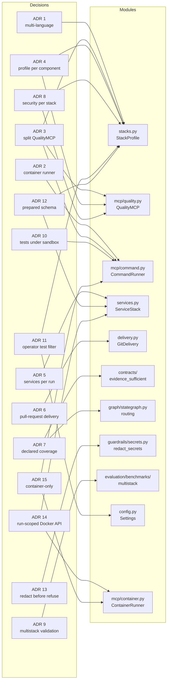

# Architecture decision records

Decisions that shape the system, in the order they were taken. These are
tracked in git deliberately: `PROJECT_STATE.md` and the handoff files are
ephemeral working state, and anything recorded only there is lost when a session
rotates it out.

Each record explains why the system is the way it is. What it does today belongs
to the [implemented architecture](../overview.md); what has actually been run
belongs to [status](../../status.md).

| # | Decision | Status |
|---|---|---|
| [1](0001-target-multiple-language-ecosystems.md) | Target multiple language ecosystems | accepted |
| [2](0002-container-runner.md) | Execute target-project commands in a container | accepted |
| [3](0003-split-quality-mcp.md) | Split QualityMCP into quality, runner, and stack profile | accepted |
| [4](0004-profile-per-component.md) | A profile describes a component, not a repository | accepted |
| [5](0005-services-per-run.md) | A project's services live for the run, on a network that reaches nothing else | accepted |
| [6](0006-github-origin-pull-request-delivery.md) | GitHub is an origin, and a pull request is how work is delivered | accepted |
| [7](0007-declared-coverage-decides-remediation.md) | A stage declares what it could not see, and the router believes the count | accepted |
| [8](0008-security-evidence-per-stack.md) | Security evidence belongs to the component toolchain | accepted |
| [9](0009-real-multistack-validation.md) | Validate infrastructure before expanding model tasks | accepted |
| [10](0010-integration-tests-need-the-host-docker-api.md) | Integration tests run under the process sandbox, not the container runner | superseded by [15](0015-container-only.md) |
| [11](0011-the-operator-states-which-tests-the-gate-runs.md) | The operator states which tests the gate runs | accepted |
| [12](0012-a-started-database-is-not-a-prepared-one.md) | A started database is not a prepared one | accepted |
| [13](0013-a-prompt-is-redacted-before-it-is-refused.md) | A prompt is redacted before it is refused | accepted |
| [14](0014-a-docker-api-that-is-not-the-hosts.md) | The run gets a Docker API that is not the host's | accepted |
| [15](0015-container-only.md) | The process sandbox is retired: the container is the only boundary | accepted |

A decision here outranks the same claim made anywhere untracked. When they
disagree, this directory is right and the other file is stale.

## Which module each decision governs

Every edge points at the code where the decision is observable, so the distance
from "why" to "where it is checked" stays one hop.

## About the "finding N" references

Several records cite a `finding N`. Those come from the multistack audit
register of 2026-09-05, retired from active documentation because it is a dated
inventory rather than current design. Any conclusion of it that is still open
belongs to [status](../../status.md); the original register stays in the
[historical archive](../../deprecated/README.md), outside normal navigation.
