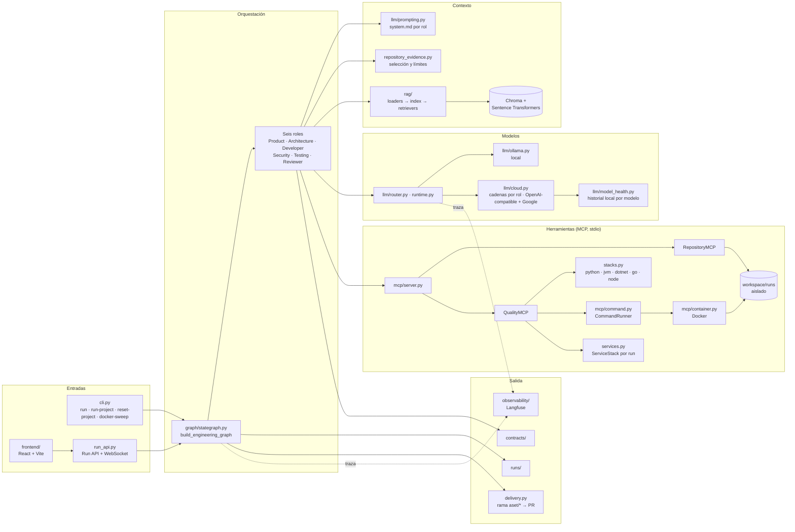
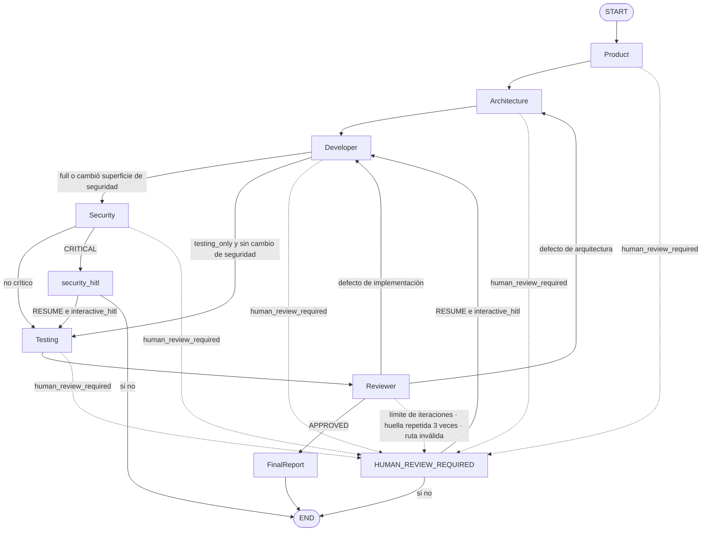

# Arquitectura implementada

Esta página describe la composición que hoy existe en el código. El porqué de
cada límite pertenece a las [decisiones](decisions/README.md); la evidencia de
lo que se ejecutó realmente pertenece únicamente al [estado](../status.md).

## Vista de conjunto

Solo el StateGraph decide transiciones. Los agentes producen contratos; las
herramientas producen evidencia; ninguno de los dos elige el siguiente paso.

## Entradas

La [CLI](../../src/engineering_team/cli.py) expone `run`, `run-project`,
`reset-project` y `docker-sweep`. `run-project` trabaja sobre una ruta o, con
`--repo`, sobre un clon temporal
([ephemeral_checkout.py](../../src/engineering_team/ephemeral_checkout.py)) que se
elimina al terminar, y delega en
[run_on_project](../../src/engineering_team/apply_run.py), que obtiene estado y
traza de ejecución, construye el resultado y condiciona la entrega a
autorización y configuración.

La [app FastAPI](../../demo-projects/sample_app/app/main.py) monta los routers de
proyectos y runs, además del endpoint bancario de ejemplo. La
[Run API](../../src/engineering_team/run_api.py) ofrece lanzamiento, consulta,
eventos, aplicación, restauración y WebSocket. El
[frontend](../../frontend/src/App.tsx) usa el
[cliente de runs](../../frontend/src/api/runClient.ts); el proxy de desarrollo
está en [Vite](../../frontend/vite.config.ts).

## Orquestación

[build_engineering_graph](../../src/engineering_team/graph/stategraph.py)
construye el StateGraph con los roles Product, Architecture, Developer, Security,
Testing y Reviewer, más los nodos `FinalReport`, `HUMAN_REVIEW_REQUIRED` y
`security_hitl`. El mismo archivo contiene `build_walking_graph`, un recorrido
simplificado; no describe la ejecución sobre proyectos reales.

Las aristas punteadas son la misma guarda repetida: **cualquier** nodo de agente
sale a `HUMAN_REVIEW_REQUIRED` cuando el estado trae `human_review_required`, no
solo el Reviewer. Con `interactive_hitl` el grafo compila con `InMemorySaver` y
los dos nodos humanos pueden reanudar (`human_decision == "RESUME"`); sin él
terminan en `END`.

El Reviewer recomienda; la validación determinista elige la arista. La iteración
sube exactamente una vez por rechazo; al alcanzar `max_remediation_iterations`
(`MAX_REMEDIATION_ITERATIONS`, 5 por omisión) el grafo sale a
`HUMAN_REVIEW_REQUIRED` y no empieza otro ciclo. Además, cada rechazo deja una
huella de su clase de fallo (`remediation_fingerprint`): categoría, motivo y
problemas sin números, porcentajes ni duraciones, y sin el riesgo residual de
dependencias previas. La tercera vez que la misma huella aparece en la corrida,
aunque no sea consecutiva, sale a revisión humana antes del límite; ninguna
repetición se envía a Architecture. La
[auditoría del 2026-09-16](../audit160926/README.md) midió el bucle que esta
regla corrige. Los predicados y límites exactos viven en el grafo y en sus
[tests de enrutado](../../tests/graph/test_routers.py) y
[de HITL](../../tests/graph/test_hitl.py).

## Contexto y modelos

[apply_run.py](../../src/engineering_team/apply_run.py) compone runtimes de
modelos, herramientas, retriever y traza. La
[capa LLM](../../src/engineering_team/llm/) contiene selección y ejecución;
[prompting.py](../../src/engineering_team/llm/prompting.py) carga un `system.md`
por rol y construye contexto.
[repository_evidence.py](../../src/engineering_team/repository_evidence.py)
contiene selección y límites de evidencia de archivos.

Solo Product, Architecture, Developer y Security invocan modelos; Testing y
Reviewer son compuertas deterministas sobre evidencia MCP
([stategraph.py](../../src/engineering_team/graph/stategraph.py)). Tampoco todas
las llamadas deciden contenido: la salida del modelo de Architecture debe ser
idéntica al candidato determinista, y la de Security debe conservar estado,
severidad, hallazgos y fuentes
([runtime.py](../../src/engineering_team/llm/runtime.py)). Solo Developer
escribe contenido que el modelo decide, y Product puede ampliar reglas y
criterios. [cloud.py](../../src/engineering_team/llm/cloud.py) define una cadena
ordenada de proveedor y modelo por rol —proveedores compatibles con OpenAI (Groq,
Mistral, OpenRouter, xKiro, Vyce, TokenForge, NVIDIA, Kilo, Cohere, Cloudflare
Workers AI) y Google— que `CLOUD_CHAIN_<ROL>` sobreescribe.
[model_health.py](../../src/engineering_team/llm/model_health.py) lleva un
registro local (`MODEL_HEALTH_PATH`, ignorado por Git) de los resultados
recientes de cada modelo por rol y relega al final de su cadena, sin retirarlo,
al que acumula fallos. Cuando un requisito no nombra archivos, Developer pide
primero un `DeveloperTargetPlan` que Python valida contra el inventario del
repositorio antes de leer o escribir
([developer_plan.py](../../src/engineering_team/contracts/developer_plan.py)): no
edita tests originales y los archivos nuevos quedan acotados a su componente.
Planificador y autor reciben además los hechos declarados del proyecto
—versiones de manifiestos e imports de los tests existentes— desde
[project_facts.py](../../src/engineering_team/project_facts.py). Developer tiene
plazos propios (`DEVELOPER_LLM_TIMEOUT_SECONDS`, `DEVELOPER_ROLE_TIMEOUT_SECONDS`).
Que un proveedor figure en una cadena no demuestra que responda; ver
[estado](../status.md).

[build_retriever](../../src/engineering_team/rag/__init__.py) compone carga,
fragmentación, índice y recuperación.
[loaders.py](../../src/engineering_team/rag/loaders.py) convierte Markdown del
corpus en documentos con procedencia;
[index.py](../../src/engineering_team/rag/index.py) y
[retrievers.py](../../src/engineering_team/rag/retrievers.py) implementan índice
y recuperación sobre Chroma. `knowledge/` es entrada del sistema, no descripción
de su arquitectura.

## Herramientas, stacks y servicios

[mcp/server.py](../../src/engineering_team/mcp/server.py) construye servidores de
repositorio y calidad por stdio.
[QualityMCP](../../src/engineering_team/mcp/quality.py) es la superficie de
operaciones de calidad.
[command.py](../../src/engineering_team/mcp/command.py) declara el contrato
`CommandRunner` y lo que toda ejecución comparte —el comando, su límite de
salida y su plazo—; [container.py](../../src/engineering_team/mcp/container.py)
es su única implementación: todo comando de calidad corre dentro de un
contenedor Docker. Para componentes `node`,
[workspace_runner.py](../../src/engineering_team/mcp/workspace_runner.py)
especializa ese runner: el repositorio vive en un volumen nativo por runner y
solo vuelven deltas comprobados, porque el bind mount de Docker Desktop falla con
la extracción concurrente de npm. En ambos casos `.git` se monta de solo lectura
dentro del contenedor. El contrato vive aparte porque sobrevivió a la
implementación que ya no está —el sandbox de proceso con `sandbox-exec` y
Bubblewrap, retirado en la [decisión 15](decisions/0015-container-only.md)—.
Esa separación es la [decisión 3](decisions/0003-split-quality-mcp.md), y el
runner en contenedor, la
[decisión 2](decisions/0002-container-runner.md).

[stacks.py](../../src/engineering_team/stacks.py) declara los perfiles `python`,
`jvm`, `dotnet`, `go` y `node` con sus comandos de instalación, lint, test,
build, integridad de dependencias, evidencia de seguridad y migración de
esquema. Cada perfil describe un componente, no un repositorio
([decisión 4](decisions/0004-profile-per-component.md)), y su evidencia de
seguridad sale de su propio toolchain
([decisión 8](decisions/0008-security-evidence-per-stack.md)).
[components.py](../../src/engineering_team/components.py) y
[services.py](../../src/engineering_team/services.py) contienen selección de
componentes y gestión de servicios del proyecto, que viven una sola ejecución
([decisión 5](decisions/0005-services-per-run.md)).

Un perfil declarado no demuestra validación en vivo de todo ese ecosistema;
consultar [estado](../status.md).

## Contratos y salida

Los tipos compartidos están en
[contracts](../../src/engineering_team/contracts/), incluido el
`evidence_sufficient` sobre el que decide el enrutado
([decisión 7](decisions/0007-declared-coverage-decides-remediation.md)). La
persistencia está en [runs](../../src/engineering_team/runs/); la instrumentación
y evaluación, en [observability](../../src/engineering_team/observability/).
[delivery.py](../../src/engineering_team/delivery.py) separa la entrega en GitHub
de la ejecución del grafo
([decisión 6](decisions/0006-github-origin-pull-request-delivery.md)), y
[guardrails/secrets.py](../../src/engineering_team/guardrails/secrets.py) redacta
antes de negar ([decisión 13](decisions/0013-a-prompt-is-redacted-before-it-is-refused.md)).

Usar el [mapa](../README.md) para localizar pruebas. Esta página describe
composición inspeccionada; la evidencia ejecutada pertenece únicamente a
[estado](../status.md).
