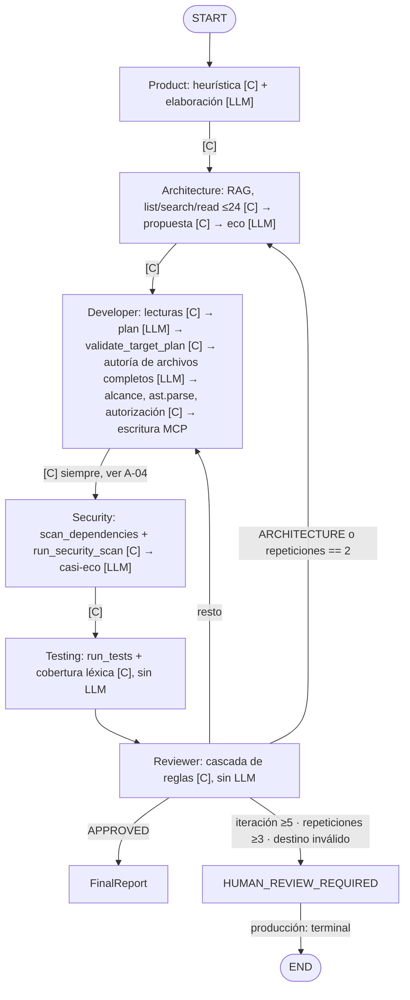

# ASET frente a «Building effective agents» (Anthropic)

Auditoría del 2026-09-16 sobre `gh-run-testing` @ `92742b7`. Fuente de
trabajo: auditor A1 ([papel de trabajo](anexos/A1-anthropic-patterns.md)),
adjudicado por el auditor principal. Las referencias `ruta:línea` son relativas
a `src/engineering_team/` salvo que se indique otra raíz.

## Clasificación

**ASET es un workflow, no un sistema de agentes en el sentido de Anthropic.**
Ningún modelo elige una transición, una herramienta, un argumento de herramienta
ni el momento de parar.

- El grafo es LangGraph 1.2.11 (`graph/stategraph.py:8-10`), pero cada arista es
  un predicado Python puro (`graph/routers.py`, `graph/stategraph.py:893-946`).
- El orquestador inició las 1649 llamadas MCP de la ventana de Langfuse; ningún
  modelo ve un esquema de herramienta. `allowed_tools` se calcula
  (`models/context.py:217`) pero nunca se renderiza en un prompt.
- De los seis «agentes», solo Developer escribe contenido que el modelo decide.

| Rol | Qué produce Python | ¿Llama a un modelo? | Qué puede cambiar el modelo |
|---|---|---|---|
| Product | heurística de palabras clave (`agents/product.py:13-19`) | sí, 1 | añadir reglas y criterios; las listas gobernadas se conservan (`llm/runtime.py:326-355`) |
| Architecture | propuesta completa desde lecturas rankeadas (`agents/architecture.py:205`) | sí, 1 | **nada**: `actual == candidate` (`llm/runtime.py:293-297`) |
| Developer | candidato de plan y alcance de escritura | sí, 2 (plan y autoría) | campos del plan validados y `file_contents` |
| Security | revisión desde escáneres y palabras clave (`agents/security.py:71-201`) | sí, 1 | estado, severidad, hallazgos y fuentes gobernados (`llm/runtime.py:336-374`) |
| Testing | compuerta determinista | **no** (`graph/stategraph.py:600-603`) | — |
| Reviewer | compuerta determinista (`agents/reviewer.py:170-415`) | **no** | — |

Verificado en tiempo de ejecución: las 81 generaciones exitosas de Architecture
y Security devolvieron un JSON idéntico al candidato de su prompt. En la práctica
el sistema es **una cadena de prompts determinista con compuertas programáticas y
un único generador (Developer) dentro de un bucle evaluador-optimizador cuyo
evaluador es código**. Es una arquitectura defendible; los problemas están en las
llamadas que rodean al generador, en criterios de evaluación no objetivos y en
que el bucle no entrega la verdad del entorno al generador.

## Flujo de control real

`[C]` indica decisión de código; `[LLM]`, llamada a modelo dentro de un nodo.

Dentro de cada caja `[LLM]`: cadena de 10–11 pares proveedor/modelo con
enfriamientos y registro de salud, fallback local Ollama con reintento y
reparación, y reintento de etapa (`llm/cloud.py:428-721`,
`graph/stategraph.py:604-682`). Primera pasada: 5 llamadas lógicas; peor caso
25. En los 16 reportes crudos del 2026-09-16, `model_usage` tiene mediana 30 y
máximo 51 intentos físicos. En Langfuse, 188 de 478 generaciones tuvieron éxito
(39 %).

## Mapa de patrones

| Patrón | Dónde está en ASET | ¿Justificado? | Alternativa más simple |
|---|---|---|---|
| LLM aumentado | Código inyecta RAG y resultados MCP; el estado tipado es la memoria | Sí | — |
| Encadenamiento con compuertas | Product → Architecture → Developer (plan → autoría) → Security, con `validate_target_plan`, `_preserves_governed_facts`, alcance, `ast.parse`, autorización destructiva | **En parte**: Developer sí; Architecture y Security no son pasos reales porque el modelo no puede cambiar su salida | Quitar las llamadas de Architecture y Security |
| Enrutamiento | `developer_next`, `security_route`, `review_route`, todos en código | Sí | Ya es simple |
| Paralelización | No existe | Votar no hace falta; seccionar scans y tests ahorraría tiempo | Opcional |
| Orquestador-trabajadores | No existe; `DeveloperTargetPlan` es planificar-y-ejecutar | Correctamente evitado | — |
| Evaluador-optimizador | Developer genera; Testing y Reviewer evalúan; ≤5 ciclos | **Sí en principio**; en la práctica el evaluador usa criterios léxicos y estructurales y no devuelve el diagnóstico al generador en 26 de 42 transiciones | Evaluar solo con tests; diagnósticos siempre a Developer |
| Agente autónomo | No existe | Evitado con honestidad; la etiqueta «agentes» sobredimensiona lo que hay | — |
| Cadenas de fallback de modelos (capa de disponibilidad, no patrón) | 12 endpoints, 10–11 modelos por rol, ledger de salud, fallback local, reintento de etapa | No justificado por resultados: 290/478 intentos fallaron; el fallback local tuvo 0/26 éxitos | Uno o dos modelos fiables por rol con reintento corto |

## Puntuación por principio (0–5)

| Principio | Nota | Motivo principal |
|---|---|---|
| Simplicidad | **1** | Diez capas de recuperación apiladas, 18 pares proveedor/modelo, 31 commits de ajuste en un día, 0/26 ciclos aceptados: la complejidad no está ganada por mejoras medidas |
| Transparencia | **3** | Contratos tipados, rutas trazadas, prompts completos en generaciones exitosas; pero 264/290 generaciones fallidas no tienen prompt ni respuesta, los errores de calidad se reportan como disponibilidad y las entradas de herramientas se enmascaran (`query=bounded`, `safe`) |
| Interfaz agente-computador (ACI) | **2** | Archivos completos como cadenas JSON (mediana 190 `\n` escapados por respuesta), razonamiento desactivado mientras el prompt pide «ejecutar mentalmente» los tests, instrucciones contradictorias, prompts de plan de hasta 83 KB, herramientas MCP sin docstrings y rol declarado por el llamador |

Condiciones del apéndice 1 para agentes de código:

| Condición | Nota | Evidencia |
|---|---|---|
| Verdad del entorno en cada paso | 3 | Tests en contenedor cada ciclo y baseline previa a escrituras (`apply_run.py:385-388`); el diagnóstico no llega a Developer en la ruta Architecture |
| Aceptación objetiva y medible | 2 | Compuerta léxica de reglas de negocio (`agents/testing.py:70-92`) y razón de cobertura de Architecture vetan trabajo verde |
| Condiciones de parada y presupuestos | 4 | Iteraciones ≤5, repeticiones ≥3, plazos por rol; falta techo de tiempo total, tokens o costo |
| Puntos de control humanos | 2 | Compuertas explícitas para escribir y entregar; `HUMAN_REVIEW_REQUIRED` es terminal en producción y mezcla caída de proveedor, fallo de infraestructura y rechazo del evaluador |
| Sandbox | 4 | Contenedores con `--cap-drop ALL`, `no-new-privileges`, límites de memoria, CPU y pids; red `none` para operaciones de workspace |

## Hallazgos

Los identificadores remiten al [registro consolidado](11-registro-de-hallazgos.md).

| ID | Severidad | Hallazgo | Confianza |
|---|---|---|---|
| C-01 | Crítica | El diagnóstico de tests no llega a Developer cuando Reviewer enruta por Architecture: `build_context` adjunta diagnósticos solo si `return_to == rol` (`models/context.py:149-150`). 34 prompts de Developer recibieron solo la frase genérica y la orden «Resolve every listed regression» sin nada listado | 0.9 |
| C-02 | Crítica | La suficiencia de evidencia de Architecture es inalcanzable por construcción en repositorios medianos (≈7 archivos visibles contra un umbral de 50 % de 19–67 rankeados) y dispara la ruta de C-01 | 0.9 |
| C-04 | Crítica | La compuerta léxica rechaza suites verdes: spring-demo-d pasó `run_tests` en 5 de 5 iteraciones y fue rechazado por no contener palabras españolas de las reglas en tests Java | 0.9 |
| A-01 | Alta | Llamadas LLM que solo pueden hacer eco terminan corridas: 252 intentos, 53 minutos de modelo, 4 de 17 trazas murieron en ellas | 0.95 |
| A-03 | Alta | El punto de control humano es terminal, mezcla clases de fallo y no hay checkpoint para reanudar | 0.85–0.9 |
| A-09 | Alta | Errores de calidad reportados como disponibilidad; la causa raíz queda tapada por el error del último modelo y el reintento repite la misma entrada | 0.8–0.9 |
| A-10 | Alta | Retroalimentación diluida: 42 % del diagnóstico que ve Developer son advisories de CVEs previos que se le prohíbe tocar, más el pie `[Help 1]` de Maven (mismo mecanismo que la sección de [12 capas](05-doce-capas.md)) | 0.85 |
| M-02 | Media | Formato de salida con sobrecarga (código dentro de JSON, reescritura de archivo completo, sin espacio para razonar) | 0.7 |
| M-03 | Media | Pila de fallback sin retorno medido y ajuste sin métrica de resultado | 0.85 |
| M-05 | Media | Generaciones fallidas opacas en trazas | 0.95 |
| B-02 | Baja | Heurísticas con forma de benchmark dentro de agentes de producción (`agents/product.py:14-19`, `agents/security.py:141-181`, fallback a `demo-projects/sample_app/app` en `mcp/quality.py:1296-1302`) | 0.8 |
| B-03 | Baja | Artefactos muertos: seis `prompts/*/user.md` nunca cargados, `system.md` de Testing y Reviewer nunca enviados, `tokenforge` fuera de toda cadena | 0.9 |
| B-04 | Baja | ACI MCP sin documentación y con rol declarado por el llamador (`mcp/server.py:30-122`); bajo impacto mientras solo llame el orquestador | 0.9 |

## Lo que ASET hace bien

- El código decide el flujo: routers puros y probados (`tests/graph/test_routers.py`).
- No usa modelo donde el código puede responder: Testing y Reviewer son deterministas.
- Compuertas programáticas reales en la única cadena genuina: validación de plan,
  igualdad de alcance de escritura, `ast.parse`, autorización destructiva y
  detector de remediación byte-idéntica (`llm/runtime.py:259-279`).
- Verdad del entorno: suite completa en contenedor aislado en cada ciclo, con
  baseline previa y separación entre regresiones y fallos nuevos
  (`agents/reviewer.py:224-232`).
- Límites explícitos y truncado declarado al modelo (`llm/prompting.py:331-340`).
- Higiene frente a inyección: contenido del repositorio y del RAG marcado como
  datos no confiables; redacción y rechazo antes del envío a la nube
  (`llm/cloud.py:489-505`, [decisión 13](../architecture/decisions/0013-a-prompt-is-redacted-before-it-is-refused.md)).
- Autodocumentación honesta: los commits citan run ids y conteos, y el
  [estado](../status.md) se niega a declarar etapas verdes sin evidencia.
